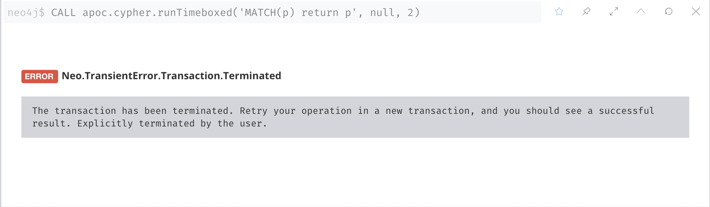

# APOC

apoc 全称: Awesome Procedures On Cypher

GitHub 仓库：https://github.com/neo4j-contrib/neo4j-apoc-procedures

## 安装

apoc 的版本必须和 neo4j 的版本一致，将 apoc-4.2.0.0-all.jar 包放在 plugins 目录下，容器启动时作为 volume 挂载到容器中。

各个 release 版本的 jar 包可以从这里下载：https://github.com/neo4j-contrib/neo4j-apoc-procedures/releases

检查 APOC 安装:

```cypher
CALL dbms.functions() YIELD name
WHERE name STARTS WITH 'apoc.'
RETURN count(name)
UNION
CALL dbms.procedures() YIELD name
WHERE name STARTS WITH 'apoc.'
RETURN count(name)
```

Output:

```console
╒═════════════╕
│"count(name)"│
╞═════════════╡
│244          │
├─────────────┤
│257          │
└─────────────┘
```

apoc-4.2.0.0-all 包含 244 个函数和 257 个过程

## 说明

函数设计的目的是通过读取数据库数据并计算返回一个结果，而过程可以对数据库数据进行修改并返回多个结果。

过程必须使用 CALL 命令来调用，函数则可以直接应用到 Cypher 查询中。

例 1, 使用 apoc procedure 创建一个 p 节点:

```cypher
CREATE (p:Person{GUID:apoc.create.uuid()})
```

查询验证:

```cypher
match(p:Person)
where p.GUID is not null
return p
```

输出:

```console
╒═══════════════════════════════════════════════╕
│"p"                                            │
╞═══════════════════════════════════════════════╡
│{"GUID":"21359f7f-08d9-444a-8f6c-9aead5d10975"}│
└───────────────────────────────────────────────┘
```

例 2,如果要查找名称或描述中包含“meta”单词的所有函数和过程:

```cypher
CALL apoc.help('meta')
```

例 3，获取图数据库 schema 的可视化视图:

```cypher
CALL db.schema.visualization()
```

例 4，随机图生成器:

```cypher
CALL apoc.generate.ba(1000, 2, "Person", "FRIEND_OF")
```

使用 Barabasi-Albert（ba）模型，会生成上千个节点，并带有 Person 标签和两个 FRIEND_OF 关系。Person 是通用的标签，每个节点都拥有自动添加的名称属性

例 5, Cypher 语句限时执行:

基于例 4 中的数据，我们可以使用它来限制用户对数据库的访问时间（CPU 占用），而不是在应用程序中通过给定的角色来限制：

```cypher
CALL apoc.cypher.runTimeboxed('MATCH(p) return p', null, 2)
```

如果数据库中有海量节点，上面的查询在 2 毫秒内如果无法返回全部结果，会得到如下错误:



## Resources

- [Procedures & Functions](https://neo4j.com/labs/apoc/4.2/overview/)
