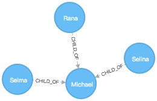

导入本地 json 文件中的数据

将 json 文件放在`./import`目录，挂载`./import`目录到 container 的`/import`目录，调用 apoc 的 procedure 导入

```cypher
CALL apoc.load.json("file:///person.json")
YIELD value
RETURN value;
```

Output:

```console
╒════════════════════════════════════════════════════════════════╕
│"value"                                                         │
╞════════════════════════════════════════════════════════════════╡
│{"name":"Michael","children":["Selina","Rana","Selma"],"age":41}│
└────────────────────────────────────────────────────────────────┘
```

create a graph based on this json file:

```cypher
CALL apoc.load.json("file:///person.json")
YIELD value
MERGE (p:Person {name: value.name})
SET p.age = value.age
WITH p, value
UNWIND value.children AS child
MERGE (c:Person {name: child})
MERGE (c)-[:CHILD_OF]->(p);
```

graph:


